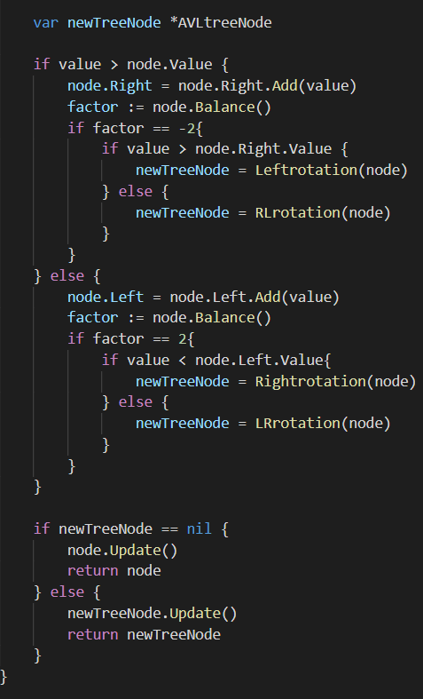
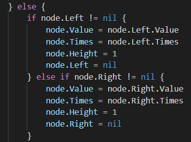

# AVL樹實作
```
參考資料 : https://josephjsf2.github.io/data/structure/and/algorithm/2019/06/22/avl-tree.html
https://goa.lenggirl.com/algorithm/search/avl_tree.html
```
## 1.AVL樹簡介
```
1.AVL樹 是嚴格平衡的二元搜尋樹
2.任一節點的左右子樹的最大高度相差為1
2.1 若左右子樹的最大高度相差為2時 可進行旋轉
3.由於是二元搜尋樹 所以其時間複雜度皆為 log(n)
```  
## 2.程式解析
## 2.1首先將節點與樹定義好

## 2.2計算節點的高度

* 如果沒有子樹的話 其高度從0加1
* 若有子樹選其中高度最高的加1 
## 2.3計算左右子樹的高度差

## 2.4定義如何旋轉

* 右旋轉示意圖(左旋轉以此類推)

## 2.5增加元素

* 若增加元素時樹根節點為空的話回傳一個值為元素高度為1的節點
* 若此樹已經有同樣的元素 將此樹的那個元素的Times加1

* 若新的值大於節點值 將新的值加到節點的右邊 ; 若新的值小於節點值 將新的值加到節點的左邊
* 加完後計算左有子樹的高度差 如果高度差等於2時要進行旋轉
## 2.6尋找

* 尋找最大(小)值 找樹的最右(左)邊的節點

* 若值大(小)於節點 向右(左)找 直到節點沒有子樹為止
 
* 中序 
## 2.7刪除元素
 
* 如果要刪除的節點沒有子樹 就可以直接刪除 再重新算高度差決定要不要旋轉 若不用旋轉 則重新計算節點的高度 ; 若要旋轉 則用新的節點計算高度

* 若要刪除的節點的左右皆有節點 則判斷左右節點的高度 在刪除 最後再重新計算高度(下圖為 左節點的高度大於右節點 的圖解 )


* 若要刪除的節點只有一邊 則判斷節點在哪邊 將那個節點取代要被刪除的節點(下圖為 只有左節點的狀況 的圖解)

## 2.8實測

